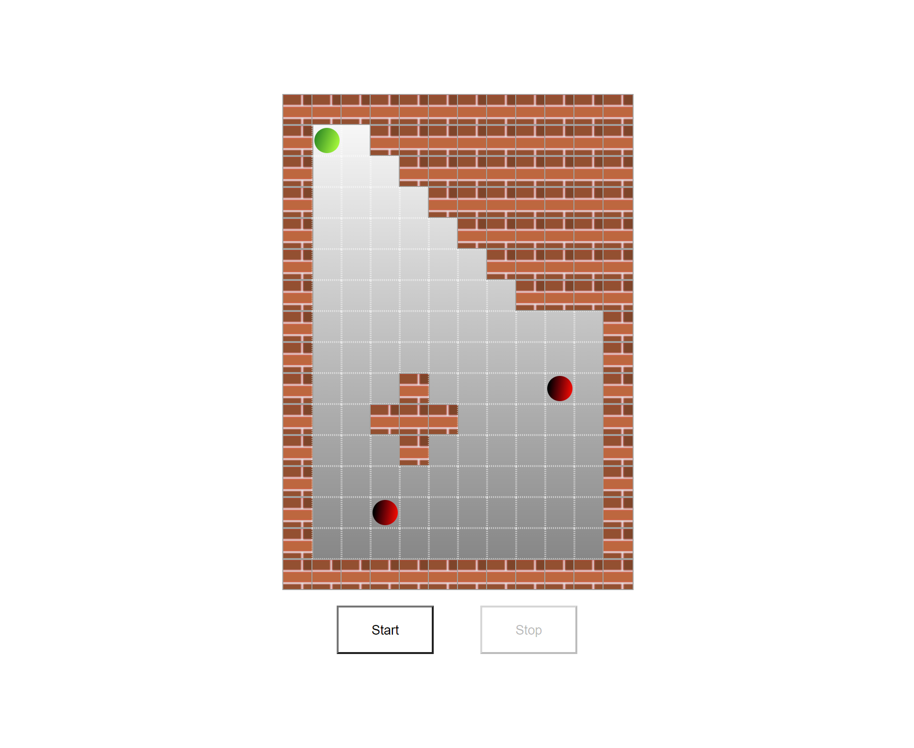

# Bouncing ball simulation

## Tool & technologies I've used

- React
- TypeScript
- styled components

## Getting Started

### Prerequisites

To run the React app, make sure you have the following software installed on your machine:

- Node.js (v14.0.0 or later)
- npm (v6.0.0 or later)

### Installation

Follow these steps to install and set up the React app:

1. Clone the repository to your local machine:

   ```bash
   git clone git@github.com:justynalem/boucning-ball-simulation.git
   ```

2. Navigate to the project's root directory:

   ```bash
   cd <project-directory>
   ```

3. Install the project dependencies:

   ```bash
   npm install
   ```

### Development

To start the development server and run the React app locally, use the following command:

```bash
npm run dev
```

This command will start the development server and open your default browser with the app running at `http://localhost:5173`.

### Building for Production

To build the React app for production, use the following command:

```bash
npm run build
```

This will create a dist directory with the compiled assets.

### Screens

# 
